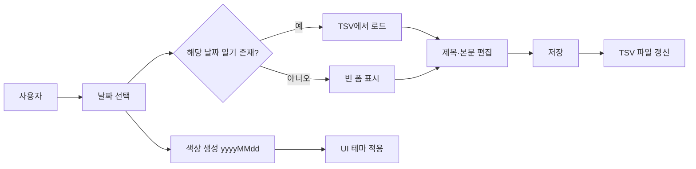

# 개인 다이어리 웹 애플리케이션 — 요구사항 문서

## 1. 문서 정보

| 항목 | 내용 |
|------|------|
| 프로젝트명 | 개인 다이어리 웹 애플리케이션 |
| 버전 | 1.0 |
| 작성일 | 2026-05-30 |
| 기술 스택 | Next.js 15, React 19, TypeScript, Tailwind CSS |

---

## 2. 프로젝트 개요

개인이 일상을 기록할 수 있는 웹 기반 다이어리 애플리케이션이다. 사용자는 날짜를 선택한 뒤 제목과 본문을 작성·저장하며, 선택한 날짜(`yyyyMMdd`)에 따라 배경색과 텍스트 색상이 자동으로 생성되어 날짜마다 고유한 시각적 분위기를 제공한다. 모든 일기 데이터는 TSV(Tab-Separated Values) 파일 형식으로 저장한다.

### 2.1 목표

- 간단하고 직관적인 UI로 일상 기록을 장애 없이 수행
- 날짜 기반 색상 테마로 일기마다 개성 있는 읽기·쓰기 경험 제공
- 파일 기반(TSV) 저장으로 데이터 이식성과 백업 용이성 확보

### 2.2 대상 사용자

- 개인 일기를 디지털로 기록하고 싶은 일반 사용자
- 별도 계정·클라우드 없이 로컬(또는 서버 파일 시스템)에 데이터를 보관하려는 사용자

---

## 3. 기능 요구사항

### 3.1 날짜 선택

| ID | 요구사항 | 우선순위 |
|----|----------|----------|
| FR-01 | 사용자는 일기를 작성·조회할 날짜를 선택할 수 있어야 한다. | 필수 |
| FR-02 | 날짜는 `yyyyMMdd` 형식(예: `20260530`)으로 내부 처리한다. | 필수 |
| FR-03 | 날짜 선택 UI는 달력, 날짜 입력 필드, 또는 이전/다음 날짜 이동 중 하나 이상을 제공한다. | 필수 |
| FR-04 | 선택된 날짜에 해당하는 기존 일기가 있으면 화면에 불러와 표시한다. | 필수 |
| FR-05 | 선택된 날짜에 일기가 없으면 빈 작성 폼을 표시한다. | 필수 |

### 3.2 일기 작성 및 편집

| ID | 요구사항 | 우선순위 |
|----|----------|----------|
| FR-06 | 사용자는 **제목**을 입력할 수 있어야 한다. | 필수 |
| FR-07 | 사용자는 **본문(내용)** 을 입력할 수 있어야 한다. | 필수 |
| FR-08 | 제목과 본문은 다중 줄 텍스트를 지원한다. | 필수 |
| FR-09 | 저장 시 선택된 날짜, 제목, 본문, 생성/수정 시각 등 필요한 메타데이터를 함께 기록한다. | 필수 |
| FR-10 | 동일 날짜에 이미 일기가 존재하면 저장 시 덮어쓰기(수정)한다. | 필수 |
| FR-11 | 저장 성공·실패에 대한 사용자 피드백(메시지 또는 UI 상태)을 제공한다. | 필수 |
| FR-12 | 작성 중 내용 초기화(새로 작성) 기능을 제공할 수 있다. | 선택 |

### 3.3 날짜 기반 색상 자동 생성

| ID | 요구사항 | 우선순위 |
|----|----------|----------|
| FR-13 | `yyyyMMdd` 값을 시드(seed)로 사용하여 **배경색**과 **텍스트 색상**을 결정론적으로 생성한다. | 필수 |
| FR-14 | 동일한 `yyyyMMdd`에 대해 항상 동일한 색상 쌍이 생성되어야 한다. | 필수 |
| FR-15 | 배경색과 텍스트 색상은 서로 대비(contrast)가 충분하여 가독성을 확보해야 한다. | 필수 |
| FR-16 | 색상은 일기 작성·조회 화면의 주요 영역(배경, 제목, 본문 텍스트)에 적용된다. | 필수 |
| FR-17 | 색상 생성 알고리즘은 HSL, RGB 변환 등 날짜 숫자를 해시·매핑하는 방식으로 구현할 수 있다. | 권장 |

**색상 생성 원칙 (예시)**

- `yyyyMMdd` 문자열 또는 숫자를 입력값으로 사용
- 배경색: 채도·명도 범위를 제한하여 눈에 편한 톤 생성
- 텍스트 색상: 배경색 대비 WCAG AA 수준(대비율 4.5:1 이상) 목표
- UI 컨트롤(버튼, 입력 필드)은 가독성을 위해 별도 스타일을 적용할 수 있음

### 3.4 데이터 저장 (TSV)

| ID | 요구사항 | 우선순위 |
|----|----------|----------|
| FR-18 | 일기 데이터는 **TSV 파일**로 저장한다. | 필수 |
| FR-19 | 필드 구분자는 탭(`\t`)을 사용한다. | 필수 |
| FR-20 | 각 행(row)은 하나의 일기 항목을 나타낸다. | 필수 |
| FR-21 | 본문에 탭·줄바꿈이 포함될 수 있으므로, 이스케이프 규칙 또는 별도 인코딩 방식을 정의한다. | 필수 |
| FR-22 | 애플리케이션 시작 시 TSV 파일을 읽어 기존 일기 목록을 로드한다. | 필수 |
| FR-23 | 저장 시 TSV 파일을 갱신(추가 또는 해당 날짜 행 갱신)한다. | 필수 |

**TSV 스키마 (제안)**

| 컬럼명 | 설명 | 예시 |
|--------|------|------|
| `date` | 일기 날짜 (`yyyyMMdd`) | `20260530` |
| `title` | 제목 | `오늘의 기록` |
| `content` | 본문 | `오늘은...` |
| `createdAt` | 최초 작성 시각 (ISO 8601) | `2026-05-30T10:00:00+09:00` |
| `updatedAt` | 최종 수정 시각 (ISO 8601) | `2026-05-30T18:30:00+09:00` |

**파일 위치 (제안)**

- 단일 파일: `data/diary.tsv` (또는 프로젝트 루트 `diary.tsv`)
- 또는 날짜별/월별 분할 파일: `data/diary_202605.tsv` (확장 시)

### 3.5 일기 조회

| ID | 요구사항 | 우선순위 |
|----|----------|----------|
| FR-24 | 날짜 선택 시 해당 일기의 제목·본문을 읽기 모드 또는 편집 가능한 형태로 표시한다. | 필수 |
| FR-25 | 저장된 일기 목록(날짜 목록)을 간단히 탐색할 수 있는 UI를 제공할 수 있다. | 선택 |

---

## 4. 비기능 요구사항

### 4.1 사용성

| ID | 요구사항 |
|----|----------|
| NFR-01 | 모바일·데스크톱 브라우저에서 반응형으로 동작한다. |
| NFR-02 | 한국어 UI를 기본으로 제공한다. |
| NFR-03 | 주요 작업(날짜 선택 → 작성 → 저장)은 3단계 이내로 완료 가능해야 한다. |

### 4.2 성능

| ID | 요구사항 |
|----|----------|
| NFR-04 | 일반적인 개인 사용 규모(수백~수천 건)에서 날짜 전환·저장이 1초 이내에 완료되어야 한다. |
| NFR-05 | TSV 파일 크기가 커질 경우를 대비해 필요 시 월별 분할 등 확장 방안을 고려한다. |

### 4.3 데이터 무결성

| ID | 요구사항 |
|----|----------|
| NFR-06 | 저장 실패 시 데이터 손실 없이 사용자에게 오류를 알린다. |
| NFR-07 | TSV 파싱 오류 시 해당 행을 건너뛰거나 오류 로그를 남기는 정책을 정의한다. |

### 4.4 보안 (초기 버전)

| ID | 요구사항 |
|----|----------|
| NFR-08 | 개인 로컬/단일 사용자 전제 시 인증은 선택 사항이다. |
| NFR-09 | 서버 API를 사용할 경우 파일 경로 traversal 등 입력 검증을 적용한다. |

---

## 5. 화면 구성 (개요)

### 5.1 메인 화면

```
┌─────────────────────────────────────────┐
│  [날짜 선택]  ◀  2026-05-30  ▶          │
├─────────────────────────────────────────┤
│  (날짜 기반 배경색 / 텍스트 색 적용)      │
│                                         │
│  제목: [________________________]       │
│                                         │
│  본문:                                  │
│  ┌─────────────────────────────────┐   │
│  │                                 │   │
│  │                                 │   │
│  └─────────────────────────────────┘   │
│                                         │
│              [ 저장 ]  [ 초기화 ]        │
└─────────────────────────────────────────┘
```

### 5.2 화면별 요소

| 요소 | 설명 |
|------|------|
| 날짜 선택 영역 | 현재 선택 날짜 표시 및 변경 |
| 제목 입력 | 단일 또는 짧은 텍스트 입력 |
| 본문 입력 | 여러 줄 텍스트 영역 |
| 저장 버튼 | TSV에 현재 일기 저장 |
| 테마 영역 | `yyyyMMdd` 기반 배경·텍스트 색상 적용 |

---

## 6. 데이터 흐름



---

## 7. 기술 구현 가이드 (참고)

| 영역 | 제안 |
|------|------|
| 프레임워크 | Next.js App Router |
| 스타일 | Tailwind CSS + 동적 inline style 또는 CSS 변수 |
| 색상 생성 | `yyyyMMdd` → 해시 → HSL(h, s, l) 변환 유틸 함수 |
| 파일 I/O | Server Actions 또는 API Route (`fs` 모듈) |
| 상태 관리 | React `useState` / `useEffect` (초기 버전) |

---

## 8. 제약 및 가정

- 초기 버전은 **단일 사용자·단일 기기** 사용을 가정한다.
- TSV 파일은 애플리케이션이 접근 가능한 로컬 또는 서버 디렉터리에 저장한다.
- "제국"은 **제목**, "레스트"는 **본문(내용)** 의 의미로 해석하여 요구사항에 반영하였다.
- 클라우드 동기화, 다중 사용자, 암호화는 본 문서 1.0 범위에 포함하지 않는다.

---

## 9. 향후 확장 (Out of Scope — v1.0)

- 사용자 계정 및 로그인
- 이미지·첨부 파일
- 태그, 검색, 통계
- 클라우드 백업 (Google Drive, S3 등)
- 일기 내보내기 (PDF, JSON)
- 다크 모드 수동 전환 (날짜 테마와 별도)

---

## 10. 수용 기준 (Acceptance Criteria)

1. 임의의 날짜를 선택하고 제목·본문을 입력한 뒤 저장하면 TSV 파일에 해당 날짜 행이 기록된다.
2. 동일 날짜를 다시 선택하면 저장된 제목·본문이 표시된다.
3. 같은 `yyyyMMdd`를 선택할 때마다 동일한 배경색·텍스트 색상이 적용된다.
4. 서로 다른 날짜는 (대부분) 서로 다른 색상 테마를 가진다.
5. 배경과 텍스트의 대비로 본문을 편하게 읽을 수 있다.
6. TSV 파일을 외부 도구(스프레드시트 등)로 열어 내용을 확인할 수 있다.

---

## 11. 용어 정의

| 용어 | 정의 |
|------|------|
| `yyyyMMdd` | 연 4자리 + 월 2자리 + 일 2자리, 구분자 없음 (예: `20260530`) |
| TSV | Tab-Separated Values, 필드 구분에 탭 문자 사용 |
| 색상 테마 | 특정 날짜에 매핑된 배경색·텍스트 색상 쌍 |
| 일기 항목 | 하나의 날짜에 대응하는 제목·본문·메타데이터 묶음 |
